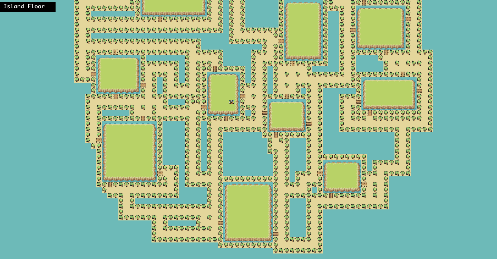
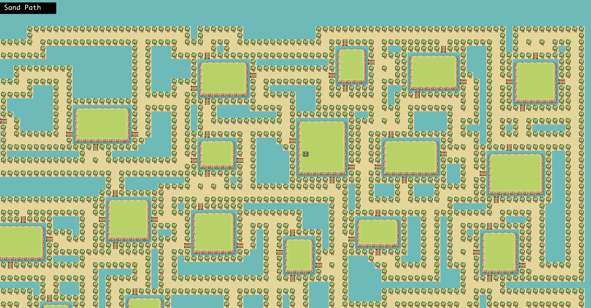
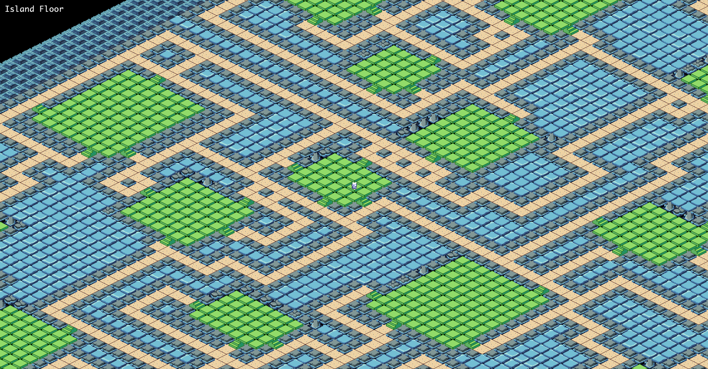
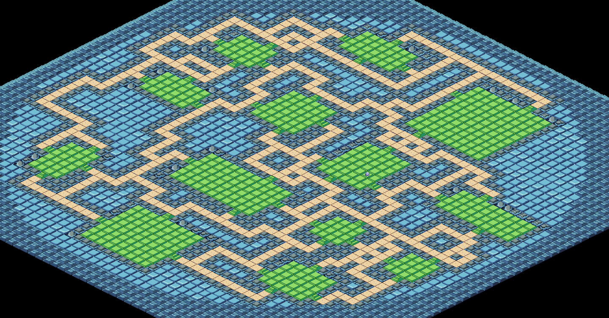
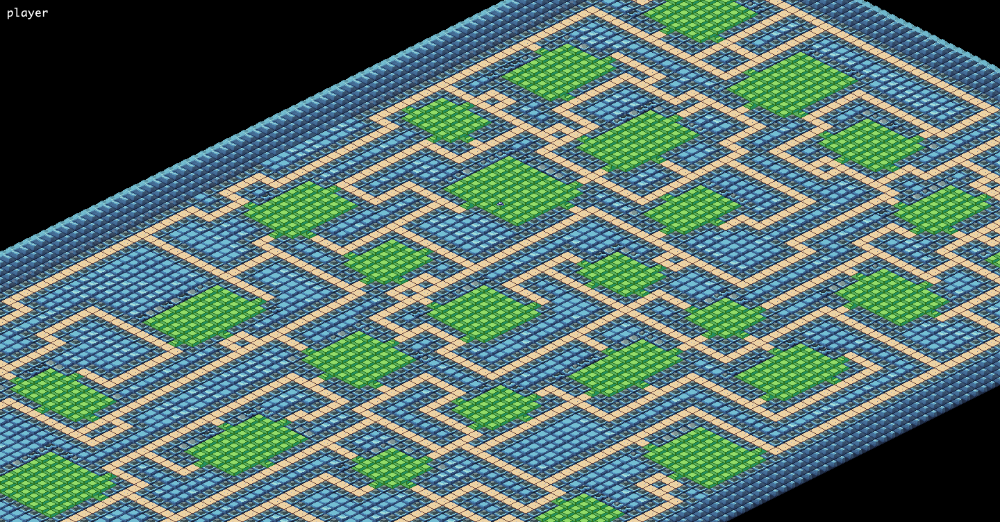
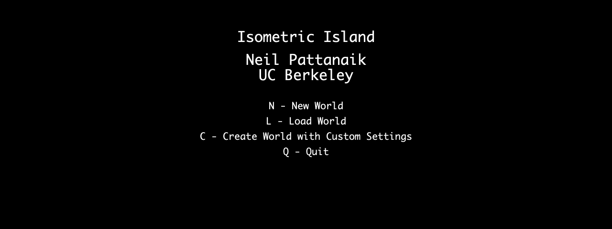

# Isometric Island

This project is a Java-based game that pseudorandomly generates an interactive explorable world. The game can be run in both interactive and batch modes, allowing users to either interact with the game in real-time or generate worlds based on predefined seeds.
From the main menu, players can start a new game, load a saved game, or create a world with custom settings. To generate a world with custom settings, players can specify parameters such as world dimensions, spread, shape, room dimensions, and more.

## Features

- **Isometric and Standard Views**: Switch between isometric and standard views for different visual experiences.
- **World Generation**: Generate worlds with customizable parameters such as shape, spread, dimensions, and more.
- **Interactive Mode**: Play the game interactively with a main menu and user inputs.
- **Batch Mode**: Generate worlds using command-line arguments for automated testing or batch processing.
- **Save and Load**: Save the current game state to a file and load it later.

## Screenshots

### Circular World


### Rectangular World


### Isometric Rendering




## Animated Player Movement
https://github.com/user-attachments/assets/0913c7e8-bdc9-4abe-8628-d8bc22dfc92a

### Main Menu


## Usage 

### Custom World Generation

To generate a world with custom settings, select the "Create World with Custom Settings" option from the main menu and follow the prompts to enter your desired parameters:
- **World Dimensions**: Enter the height and width of the world.
- **Spread**: Enter the spread of the world (e.g., "sparse", "scattered", "dense").
- **Shape**: Enter the shape of the world (e.g., "rectangular", "circular", "cubic").
- **Room Dimensions**: Enter the minimum and maximum dimensions of rooms.
- **Continuation**: Enter the continuation type of the world (e.g., "custom", "straight", "semi-straight", "arbitrary").
- **Continuation Percentage**: Enter the percentage of continuation for the world (if previous option was custom).

### Game Controls

- **'WASD' keys**: Move the player in the corresponding direction.
- **'K'**: Switch between isometric and standard views.
- **Arrow Keys**: Move the camera in the corresponding direction.
- **'P'**: Center the camera on the player and enable following.
- **'+' and '-'**: Zoom in and out (only available in isometric view).
- **':Q'**: Quit the game and return to the main menu. Game state is automatically saved.

## Getting Started

### Prerequisites

- Java Development Kit (JDK) 8 or higher
- IntelliJ IDEA or any other Java IDE

### Installation

1. Clone the repository:
    ```sh
    git clone https://github.com/neilpattanaik/explorable-world-generator.git
    ```
2. Open the project in your IDE.
3. Import the libraries in library-su24.zip.
   
### Running the Game

#### Interactive Mode

1. Run the `Main` class.
2. Use the main menu to start a new game, load a saved game, or create a world with custom settings.

#### Batch Mode

1. Run the `Main` class with a seed as a command-line argument:
    ```sh
    java core.Main 123456789
    ```
